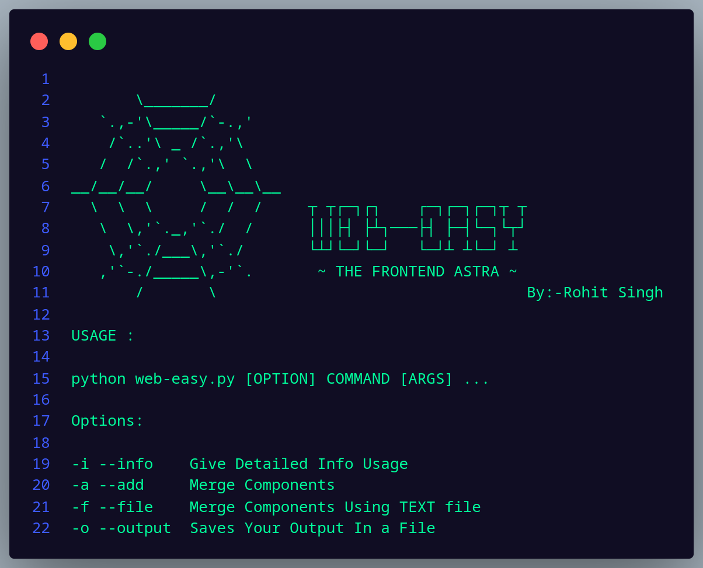

# Web Easy - The Frontend ASTRA
Web-easy is a Terminal based frontend automation tool.It helps in your web development and makes your frontend pages in a seconds.In web-easy there are many pre-build frontend components like navbar , hero , card , footer , login pages etc.

Check The Website <a href="https://webeasy.netlify.app/" >webeasy.netlify.app</a>

ScreenShots : 

